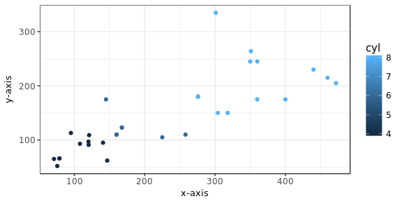
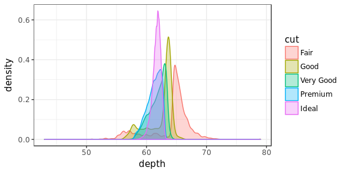

A Data Scientific Approach to Equity Backtesting Research
================

<!-- First: Set your default preferences for chunk options: -->
<!-- If you want a chunk's code to be printed, set echo = TRUE. message = FALSE stops R printing ugly package loading details in your final paper too. I also suggest setting warning = FALSE and checking for warnings in R, else you might find ugly warnings in your paper. -->
<!-- ############################## -->
<!-- # Start Writing here: -->
<!-- ############################## -->
**This is a working paper. It is extremely messy and not intended to be read by anybody. It has been made publically avaialable to facilitate discussion among collaborators on the project.**

Introduction
============

The objective of this thesis is to rebuild the Equity Asset Management research and trading pipeline in a Data Scientific way. The final body of work should provide a set of best practices guidelines that Asset Managers can use in production to improve their processes. This project has two objectives. The first is the rigorous documentation and construction of an equity research environment. The second is to engage in a process of discovery in the equity research space with a view to uncovering interesting topics to drill down to for future research. It is expected that this body of work can sustain several thesis topics. I have structured it in a modular way so that I can start at the beginning of the data science stack and move towards actual analysis. But if I don’t get that far then I think the building and documentation of an equity research environment would be of considerable use to academics and professionals in the field.

Modular Approach
================

A guiding principle in the construction of my thesis topic is "don't reinvent the wheel." My topic is structured as a series of layers. Each successive layer is enabled by the layers below it. If a solution exists for any particular layer, the existing in-the-wild implementation can be documented and implemented and I can move on to the next layer. If a layer has not been implemented, or if no readily accessible open-source solution exists, I will endeavour to document a solution and compile a set of best practices.

My thesis will serve several purposes. It will be -

1.  A collection of methods and recommendations for conducting equity research in con- junction with common statistical software packages.
2.  An instruction manual for building an equity research environment to current statistical best practices.
3.  A working open source system which can be cloned by equity researchers to enable furthering of the discipline of equity research.
4.  A demonstration set for what can currently be achieved in the space using existing open source tools

The layers, ordered according to the Data Science stack, are as follows -

1.  Documentation and construction of an updatable dataset that is free from survivorship and look ahead bias, accurately models slippage and transaction costs.
2.  Implementation of an event-based backtester that can compute optimal trades at each rebalancing period using both market and fundamental data.
3.  Evaluation of various machine learning prediction methods for their alpha-generation capabilities.

Proposal
========

Although each of the layers mentioned above appear simple, they each contain deep, difficult to surmount challenges. I expect that each of these layers are sufficient for a full thesis. I would like to spend the first four months of the 2018 calendar year building a data pipeline and research environment. The objective of this phase is to construct a working research environment and to search for interesting areas of further research. In the fifth month, I will review the potential topics I have uncovered and select one for further research. If no topics are suitable, I will refactor the code generates in the plat- form building phase, thoroughly document it, and submit it as my thesis. In this fallback scenario my thesis will be an open source software package and manual for the con- struction of a full equity research environment, form data collection through to trading. I intend to release this as open source software to serve as a guide for future researchers and enthusiasts. I have already identified the following topics that could be interesting subjects for deeper study: 1. Dataset Construction Clean, accurate datasets are important for both the backtesting and management of investment portfolios. The absence of such a dataset severely limits the management capabilities of an asset management firm and renders most academic research into systematic investment management useless. By building and documenting best prac- tices for equity dataset construction, I hope to enable quality, real-world applicable re- search in my academic peers and to provide the tools that asset managers need to rig- orously apply portfolio management theory to practice. Equity asset managers typically measure their investments against a benchmark. How- ever, most asset managers obtain the benchmark timeseries from data vendors, and if they do have the ability to create it in-house, it is a manual human-driven process. Data from vendors is often contradictory. Problems to be solved in this section would include - 1. Selection and construction of an appropriate database solution, weighing speed and simplicity against consistency and atomicity. Review of existing technologies and schema. Research into the appropriate ways of dealing with validation time versus transactional time and define a method for dealing with contradictory data from multiple data sources. 2. Automate the consumption of underlying constituent data and the building of the benchmarks from first principles. Consume multiple sources and use selection or aver- aging rules to reconcile conflicting datas sources. 2. Building a Backtester Backtester construction is well documented, and there exist some excellent open source solutions. However, these solutions tend to be focused on US markets, and they lack certain capabilities. The primary shortcoming of these packages is that they tend to be security-centric, not benchmark-centric. For instance, zipine, the popular python algorithmic trading package, currently provides no functionality for simply executing aThesis Proposal passive market-cap-weighted investment strategy. Baskets of stocks can only be spec- ified by manual lists. This renders the zipline package useless to professional asset managers, since modern portfolio management is centered around active-weight deviations from a benchmark. The starting point of any portfolio should be a benchmark portfolio, and a trading algo- rithm should specify deviations from the benchmark. Problems in this section would be - 1. A survey of existing implementations, along with a summary of capabilities and shortcomings 2. Assessment of these systems from a modern portfolio theory perspective 3. Leverage the work done in dataset construction to build an event-driven backtester that allows an asset manager to rigorously backtest investment ideas. 3. Evaluation of various Machine Learning prediction methods This topic can only be tackled once the above two topics have been dealt with. There is a fair amount of research on the implementation of machine learning algorithms for the prediction of stock prices. Research in this area appears to be fraught with poor data input and inaccurate modeling of transaction and slippage costs. This section would involve selecting several heavily-cited papers in the space and at- tempting to replicate them using our dataset and trading models. I am especially inter- ested in whether results are replicable, and what the impact of real-world transaction and spread costs would be. 4. Retool the portfolio implementation and research process along the lines of the Good Judgment Project This would be more of a theoretical topic. There has been a lot of good work done at the Good Judgment Project on the process of forecasting, and on the management of professional forecasters. See <https://www.edge.org/conversation/philip_tetlock-a-> short-course-in-superforecasting. Equity analysts and portfolio managers are professional forecasters, but there is very little quantifiable measurement of the forecasting abilities of these experts. Typically, analysts are simply measured on the excess return of their stock picks relative to the universe. The term for this is attribution, and it is the answer to the question, “what per- centage of our fund’s return is attributable to each analyst?”. The Good Judgment Project has developed a much more fine-grained approach to measuring forecasting, and they recognize that a forecast can be broken into separable components. In the equity price forecasting space, these component would be, for ex- ample, timing, direction of move, magnitude of move, underlying driver of move. A poor stock picker may be a very good predictor of underlying drivers of stock returns, but a poor predictor of timing responses of stocks to drivers. This topic would constitute a literature review of the new work done at the Good Judg- ment Project and translate that work into a model framework for recording the motiva-Thesis Proposal tions for stock picks. Since the thesis has to be completed by the end of 2018 I do not think I could accumulate enough data for an evaluation of the model. 5) Extension of (4) into a multi-year research project I could use (4) as a springboard for getting actual asset managers to pilot the frame- work and create an ongoing research project on the impact of this paradigm for analyst accuracy. Integrate the measurement framework detailed into (4) into an automated trading process. Trades can only happen through the bet-logging tool; no trade occurs if any fields are null; entry and exit form the stock are determined by the bet-logging informa- tion. If an analyst wants to extend / reduce / cancel a bet, a new bet must be created. For instance, a long bet in gold can only be cancelled by a short bet in gold. This basi- cally makes deviation from rational investing an 'opt-in' option: if no action is taken, no behavioural biases are introduced. The historical bets can be cubed by portfolio, analyst, time period and stock industry. and can be plotted against the benchmark. We can use statistics to determine who the good, well calibrated analysts are. We can mine this data for all sorts of interesting in- sights. Does a particular analyst generally get their initial bets correct but stymie their bets with re-bets? Then they don't have a handle on their behavioural biases. Does an analyst generally get their pharmaceutical bets right, but get their iron-ore mining bets wrong? Move them away from mining. Concluding Remarks The topics touched upon above are by no means a comprehensive account of what I think can be done in the space. But it should serve to convince the reader that there is massive scope for data science in the asset management and equity research space, both in the portfolio management workflow and in research. I would argue, in fact, that there is a significant overlap in the work that equity analysts do and that which data scientists do. Too often a finance graduate glosses past the data collection, cleaning and modeling phase of their project in order to get to their problem of interest. This invariably results in results which are worthless in the wild and is primary contributor to the maxim that “every academic backtest yields alpha, but none actually makes money”. My singular conviction is that equity researchers need to be familiarized with data sci- ence tools; they need data science-grade environments and data sources. I believe that it would be a tremendous contribution to this field if I rigorously document how a re- searcher can make that transition. A secondary goal is to actually implement the envi- ronment and then start using the tools of data science to solve problems in the areas of asset management and equity research.

------------------------------------------------------------------------

Template Follows Below. Not Part of the Content of this WIP Paper
=================================================================

Introduction 
=============

References are to be made as follows: (**???**) and (**???**) Such authors could also be referenced in brackets (**???**) and together (**???** & (**???**)). Source the reference code from scholar.google.com by clicking on \`\`cite'' below article name. Then select BibTeX at the bottom of the Cite window, and proceed to copy and paste this code into your ref.bib file, located in the directory's Tex folder. Open this file in Rstudio for ease of management, else open it in your preferred Tex environment. Add and manage your article details here for simplicity - once saved, it will self-adjust in your paper.

> I suggest renaming the top line after @article, as done in the template ref.bib file, to something more intuitive for you to remember. Do not change the rest of the code. Also, be mindful of the fact that bib references from google scholar may at times be incorrect. Reference Latex forums for correct bibtex notation.

To reference a section, you have to set a label using \`\`\\label'' in R, and then reference it in-text as e.g.: section .

Writing in Rmarkdown is surprizingly easy - see [this website](https://www.rstudio.com/wp-content/uploads/2015/03/rmarkdown-reference.pdf) cheatsheet for a summary on writing Rmd writing tips.

Data 
=====

Discussion of data should be thorough with a table of statistics and ideally a figure.

In your tempalte folder, you will find a Data and a Code folder. In order to keep your data files neat, store all of them in your Data folder. Also, I strongly suggest keeping this Rmd file for writing and executing commands, not writing out long pieces of data-wrangling. In the example below, I simply create a ggplot template for scatter plot consistency. I suggest keeping all your data in a data folder.

<!-- The following is a code chunk. It must have its own unique name (after the r), or no name. After the comma follows commands for R which are self-explanatory. By default, the code and messages will not be printed in your pdf, just the output: -->

Caption Here

To reference the plot above, add a \`\`\\label'' after the caption in the chunk heading, as done above. Then reference the plot as such: As can be seen, figure is excellent. The nice thing now is that it correctly numbers all your figures (and sections or tables) and will update if it moves. The links are also dynamic.

I very strongly suggest using ggplot2 (ideally in combination with dplyr) using the ggtheme package to change the themes of your figures.

Also note the information that I have placed above the chunks in the code chunks for the figures. You can edit any of these easily - visit the Rmarkdown webpage for more information.

Here follows another figure from built-in ggplot2 data:

Diamond Cut Plot

Methodology
===========

Subsection
----------

Ideally do not overuse subsections. It equates to bad writing.[1]

Math section
------------

Equations should be written as such:

If you would like to see the equations as you type in Rmarkdown, use $ symbols instead (see this for yourself by adjusted the equation):

$$
\\beta = \\sum\_{i = 1}^{\\infty}\\frac{\\alpha^2}{\\sigma\_{t-1}^2} \\\\ 
\\int\_{x = 1}^{\\infty}x\_{i} = 1
$$

Note again the reference to equation . Writing nice math requires practice. Note I used a forward slashes to make a space in the equations. I can also align equations using **&**, and set to numbering only the first line. Now I will have to type \`\`begin equation'' which is a native command. Here follows a more complicated equation:

Note that in I have aligned the equations by the equal signs. I also want only one tag, and I create spaces using \`\`quads''.

See if you can figure out how to do complex math using the two examples provided in and .

<!-- $$ -->
<!-- This is a commented out section in the writing part. -->
<!-- Comments are created by highlighting text, amnd pressing CTL+C -->
<!-- \\begin{align} -->
<!-- \\beta = \\alpha^2 -->
<!-- \end{align} -->
<!-- $$ -->
Results
=======

Tables can be included as follows. Use the *xtable* (or kable) package for tables. Table placement = H implies Latex tries to place the table Here, and not on a new page (there are, however, very many ways to skin this cat. Luckily there are many forums online!).

To reference calculations **in text**, *do this:* From table we see the average value of mpg is 20.98.

Including tables that span across pages, use the following (note that I add below the table: \`\`continue on the next page''). This is a neat way of splitting your table across a page.

Use the following default settings to build your own possibly long tables. Note that the following will fit on one page if it can, but cleanly spreads over multiple pages:

<!-- hfill can be used to create a space, like here between text and table. -->
Huxtable
--------

Huxtable is a very nice package for making working with tables between Rmarkdown and Tex easier.

This cost some adjustment to the Tex templates to make it work, but it now works nicely.

See documentation for this package [here](https://hughjonesd.github.io/huxtable/huxtable.html). A particularly nice addition of this package is for making the printing of regression results a joy (see [here](https://hughjonesd.github.io/huxtable/huxtable.html#creating-a-regression-table)). Here follows an example:

                               Regression Output                               
                    Reg1            Reg2            Reg3            Reg4       

─────────────────────────────────────────────────────────────────────────────── (Intercept) -2256.361 \*\*\* 5763.668 \*\*\* 4045.333 \*\*\* -7823.738 \*\*\*
(13.055)    (740.556)    (286.205)    (592.049)   
carat 7756.426 \*\*\*          7765.141 \*\*\* 20742.600 \*\*\*
(14.067)             (14.009)    (567.672)   
depth          -29.650 *   -102.165 *\*\* 90.043 \*\*\*
         (11.990)    (4.635)    (9.588)   
carat:depth                            -210.075 \*\*\*
                           (9.187)   
─────────────────────────────────────────────────────────────────────────────── N 53940         53940         53940         53940        
R2 0.849     0.000     0.851     0.852    
─────────────────────────────────────────────────────────────────────────────── \*\*\* p &lt; 0.001; \*\* p &lt; 0.01; \* p &lt; 0.05.

Column names: names, model1, model2, model3, model4

From Table above, we see how to make reporting regressions easy. Making nice tables, though, takes some practice and there are various other packages you can explore as well.

Lists
=====

To add lists, simply using the following notation

-   This is really simple

    -   Just note the spaces here - writing in R you have to sometimes be pedantic about spaces...

-   Note that Rmarkdown notation removes the pain of defining environments!

Conclusion
==========

I hope you find this template useful. Remember, stackoverflow is your friend - use it to find answers to questions. Feel free to write me a mail if you have any questions regarding the use of this package. To cite this package, simply type citation("Texevier") in Rstudio to get the citation for (**???**) (Note that uncited references in your bibtex file will not be included in References).

<!-- Make title of bibliography here: -->
<!-- \newpage -->
References
==========

[1] This is an example of a footnote by the way. Something that should also not be overused.
